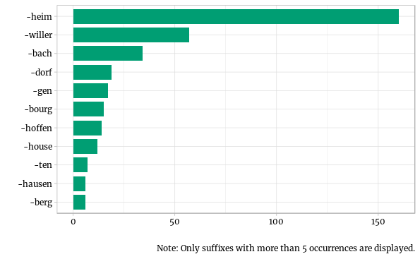

Names of places in Alsace are sometimes described as unpronounceable for French people. Most names have a Germanic root and sound pretty exotic for French speakers. I recommend taking a regional train and listening to the voice announcing the Alsatian stations with a very French pronunciation, quite a funny experience. A recent trip on the train made me think about the similarity of suffixes in Alsatian place names and I was interested to know how many places actually end on "-heim", "-willer" and so on.

This post uses data from a scraped Wikipedia table from [another post](). It contains information on communes in the département Bas-Rhin. Here, we only need the names of the places. We start by loading packages, data and pulling out the column we are interested in.


# Load packages
library(tidyverse)
library(sylly)

# Load data
bas_rhin <- read_csv("https://dwitkowski.eu/assets/data/bas_rhin.csv")

# Get name column
bas_rhin_noms <- bas_rhin %>%
  filter(nom != "Bas-Rhin") %>%
  pull(nom)


First thing to clean up is possible extensions of the place names, such as river names (e.g. -sur-Zorn or -les-Bains).


bas_rhin_noms <- str_split(bas_rhin_noms, "-") %>%
  map_chr(tail(1))


As we are interested in the suffixes of the place names, we need a method to split the strings
into syllables. We will use the method hyphen() from the [sylly](https://github.com/unDocUMeantIt/sylly){:target="_blank"} package that
takes vectors of character strings and applies an hyphenation algorithm to each word
(the algorithm was originally developed for automatic word hyphenation in LaTeX).
The algorithm needs a set of hyphenation patterns which are provided in dictionaries
for different languages. Let's try out the French (Alsace is in France!) and German
(Alsatian is a German dialect) dictionaries for the place names.


# Define dictionary for syllables
## French
url.fr.pattern <- url("http://tug.ctan.org/tex-archive/language/hyph-utf8/tex/generic/hyph-utf8/patterns/txt/hyph-fr.pat.txt")
hyph.fr <- read.hyph.pat(url.fr.pattern, lang="fr")
close(url.fr.pattern)

## German
url.de.pattern <- url("http://tug.ctan.org/tex-archive/language/hyph-utf8/tex/generic/hyph-utf8/patterns/txt/hyph-de-1996.pat.txt")
hyph.de <- read.hyph.pat(url.de.pattern, lang="de")
close(url.de.pattern)

# Split into syllables
## based on French dictionary
syllables_fr <- hyphen(bas_rhin_noms, hyph.pattern=hyph.fr) %>%
  hyphenText() %>%
  mutate(id = row_number()) %>%
  select(id, french = word)

## based on German dictionary
syllables_de <- hyphen(bas_rhin_noms, hyph.pattern=hyph.de) %>%
  hyphenText() %>%
  mutate(id = row_number()) %>%
  select(id, german = word)

# Merge data sets
syllables <- left_join(syllables_fr, syllables_de, by = "id")

# Compare the syllables based on the two dictionaries
syllables %>%
  count(french == german)



# A tibble: 2 x 2
  `french == german`     n
  <lgl>              <int>
1 FALSE                258
2 TRUE                 255


There are 255 names split in the same way, 258 differently. Indeed, the choice of the dictionary affects the outcomes. After manually inspecting the differences, I opt for the German dictionary
because it splits syllables better than the French one for the names under study
(e.g. -heim vs. -sheim, e.g. -wil-ler vs. -swiller).

However, there are still some manual corrections necessary, for example reuniting some syllables (like -wil and -ler) to get the correct suffixes.


syllables_de <- syllables_de %>%
  mutate(german = str_replace_all(german,
                            c("wil-ler" = "willer",
                              "hof-fen" = "hoffen",
                              "hou-sen" = "housen",
                              "hau-sen" = "hausen",
                              "mun-ster" = "munster",
                              "kir-chen" = "kirchen",
                              "ber-gen" = "bergen",
                              "sheim" = "heim",
                              "zheim" = "heim",
                              "schwiller" = "willer",
                              "dertheim" = "heim"))) %>%
  pull(german)


Now we are ready to extract the suffix and count their appearences.


# Extract suffix
suffixes <- str_split(syllables_de, "-") %>%
  sapply(tail, 1)

# Tidy and count suffixes
suffixes <- enframe(suffixes) %>%
  # drop obs which had only one syllable left (start with capital letter)
  filter(!str_detect(value, "^[A-Z]")) %>%
  # Count values
  count(value) %>%
  # Calculate proportion
  mutate(percent = n / cumsum(n)[length(n)]) %>%
  # Add a hyphen in beginning of suffix
  mutate(value = str_c("-", value)) %>%
  # Change suffix to factor (for correct order in bar chart)
  mutate(suffix = factor(value, levels = value[order(n)])) %>%
  # Sort data
  select(suffix, n, percent, -value) %>%  
  arrange(desc(n))

# Show 10 most common suffixes
head(suffixes, 10)



# A tibble: 10 x 3
   suffix      n percent
   <fct>   <int>   <dbl>
 1 -heim     160  0.342
 2 -willer    57  0.122
 3 -bach      34  0.0726
 4 -dorf      19  0.0406
 5 -gen       17  0.0363
 6 -bourg     15  0.0321
 7 -hoffen    14  0.0299
 8 -house     12  0.0256
 9 -ten        7  0.0150
10 -berg       6  0.0128


By far, the most common suffix in place names in Bas-Rhin is "-heim" (cf. also the graph below). More than a third of all the communes have this suffix. Other common suffixes are "-willer" (12%), "-bach" (7%), and "-dorf" (4%). As a last piece, here's a bar chart visualizing this information.


# Visualize data
ggplot(data = filter(suffixes, n > 5)) +
  geom_bar(aes(x = suffix, y = n), width = 0.8, fill = "#009E73", stat = "identity") +
  coord_flip() +
  theme_light() +
  theme(text = element_text(family = "serif"),
        axis.text.x = element_text(color = "black"),
        axis.text.y = element_text(color = "black")) +
  xlab("") +
  ylab("") +
  labs(caption = "Only suffixes with more than 5 occurrences are displayed.")


{:refdef: style="text-align: center;"}

{:refdef}

This analysis was limited to places in the département Bas-Rhin, but I might extend it to the second Alsatian département Haut-Rhin in the near future.

Get the code [here](https://github.com/chodera/chodera.github.io/blob/master/assets/projects/3_analyse_place_names_alsace/place_names.R){:target="_blank"}.
