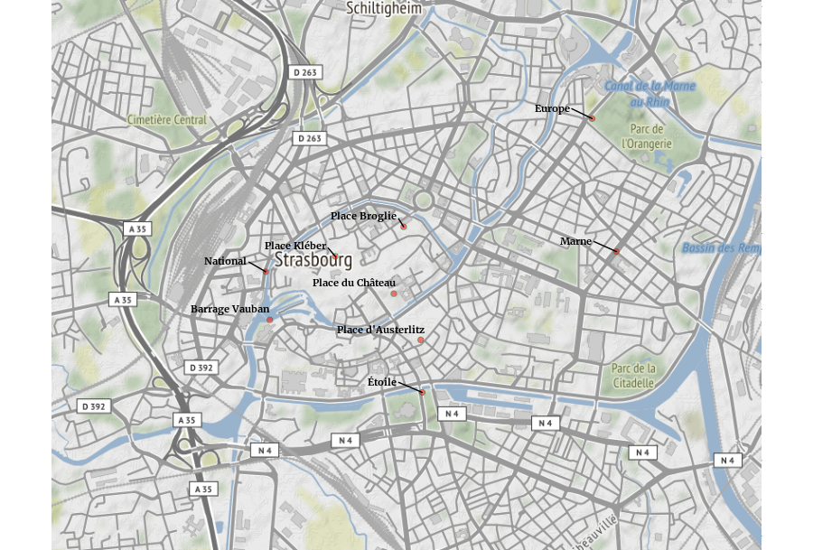

Ever wandered around a city desperately looking for a public toilet? Fear not, the open data movement is here to help. The city of Strasbourg recently opened a new open data portal and while checking their available data sets I came across the one about public toilets. I guess every city should leak information about their public toilets.

I accessed the data by using an API and made a little map showing where to find the toilets.


# Load packages
library(httr)
library(jsonlite)
library(tidyverse)
library(sf)
library(ggmap)
library(ggrepel)

# Create response object
url  <- "https://data.strasbourg.eu/api/records/1.0/search/?dataset=lieux_toilettes_publiques"
raw.result  <- GET(url)

# Check response object
status_code(raw.result)

# Access raw json data and transform into data frame
json_text <- content(raw.result, "text")
names(fromJSON(json_text))
records <- fromJSON(json_text)$records
toilettes <- records$fields

# Check data and select necessary variables
names(toilettes)
toilettes <- toilettes %>%
  select(name, point_geo) %>%
  rename(geometry = point_geo)

# Get rid of part of the string and capitalize the first letter of the remaining part
firstup <- function(x) {
  substr(x, 1, 1) <- toupper(substr(x, 1, 1))
  x
}

toilettes <- toilettes %>%
  mutate(name = firstup(str_split(toilettes$name, "Toilettes publiques ", simplify = TRUE)[,2]))

# Check data again
toilettes
# There are 10 public toilets in Strasbourg

# Let's plot them on a map

# First, extract geographic location and save as dataframe
geo_seq <- unlist(toilettes$geometry)
lat <- geo_seq[seq(1, length(geo_seq), 2)]
lon <- geo_seq[seq(2, length(geo_seq), 2)]

toilettes_geo <- toilettes %>%
  mutate(lat = lat, lon = lon) %>%
  select(name, lat, lon)
toilettes_geo

toilettes_sf <- st_as_sf(toilettes_geo, coords = c("lon", "lat"),
                   crs = 4326, agr = "constant")

# Second, get the background map
# Find coordinates with the website https://boundingbox.klokantech.com/
stras_map <- get_map(c(7.716782,48.564086,7.787678,48.600426),
                     maptype = "toner-background")

# Third, combine the two geographic data sets
ggmap(stras_map, extent = "device") +
  geom_sf(data = toilettes_sf,
          inherit.aes =FALSE,
          colour="#238443",
          fill="red",
          alpha=.5,
          size=2,
          shape=21) +
  geom_text_repel(data = toilettes_sf,
            aes(x = lon, y = lat, label = name),
            size = 2.9,
            col = "black",
            fontface = "bold",
            nudge_x = -0.004,
            nudge_y = +0.0007)

# One toilet is not on the map, it is the one it Schiltigheim, which is in the north of Strasbourg.


Here is the final result:

PS: Public toilets in France are **free**.

Get the code [here](https://github.com/chodera/chodera.github.io/blob/master/assets/projects/4.%20Public%20Toilets%20in%20Strasbourg/strasbourg_toilettes.R){:target="_blank"}.
